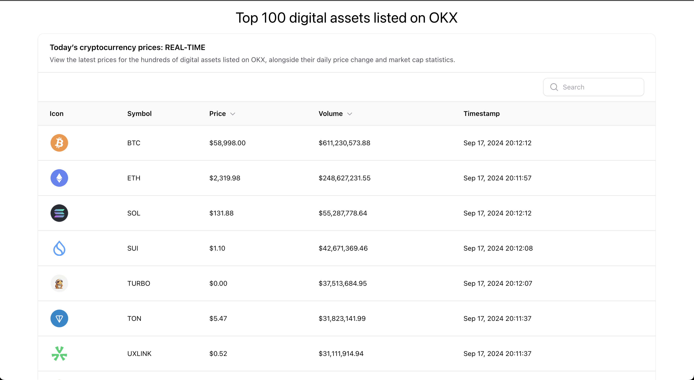

# Laravel Cryptocurrency Market API

This is a Laravel application that fetches and displays the top 100 cryptocurrency markets from the OKX exchange.



## Features

- Fetch top 100 OKX markets using `/okx/top-100-markets` API endpoint.
- Built with Laravel and Docker (Laravel Sail).
- Real-time cryptocurrency data using `ccxt` package and pusher.
- Supervisor watcher for OKX market tickers changes.
- For new exchanges need to create Laravel command (watcher) and setup to the supervisor

## Prerequisites

- [Docker](https://www.docker.com/get-started) installed on your machine.

## Setup Instructions

Follow the steps below to get the application running locally with Docker Compose.

### 1. Clone the repository

```bash
git clone https://github.com/your-username/ccxt-okx.git
cd ccxt-okx

# ASK developer for rest env-s ))
cp .env.example .env
```

## Start docker
```bash
docker-compose up -d
```


## Setup
```bash
# TODO: fix auto run
docker exec -it app composer install

./vendor/bin/sail artisan migrate
# Optional
./vendor/bin/sail artisan db:seed

```

## Additional Commands

```bash

# Fetch and watch OKX marked data, if supervisord not worked
./vendor/bin/sail artisan okx:watch-tickers

```


## Start web page

```
http://localhost

```

